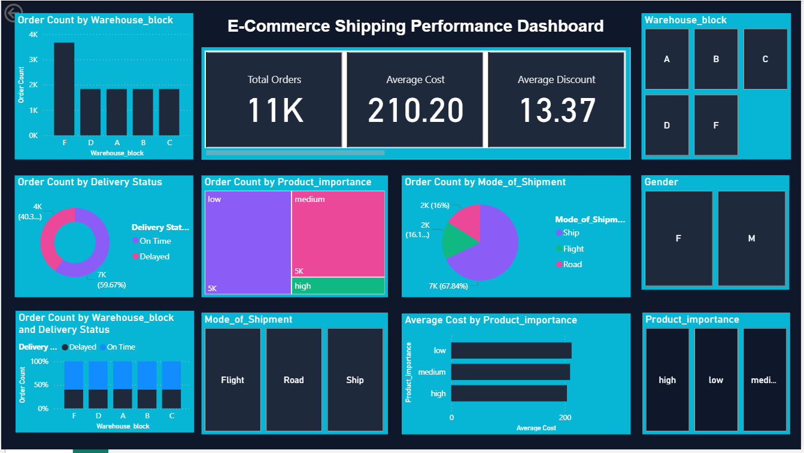

# E-Commerce-Shipping-Performance-Dashboard
Designed a professional Power BI dashboard to analyze 10,999+ e-commerce shipping records, featuring KPI cards, DAX measures, interactive filters, and insights into delivery performance, customer trends, and warehouse operations.

# Problem Statement
E-commerce companies process thousands of orders every day across multiple warehouses and shipment methods. Without a centralized dashboard, it is difficult to monitor delivery performance, identify delays, evaluate warehouse efficiency, and understand customer satisfaction. This can lead to slower decision-making and missed opportunities to improve logistics operations.

The objective of this project is to build an interactive Power BI dashboard that consolidates shipping data into a single view, enabling stakeholders to monitor key performance indicators (KPIs), analyze delivery trends, compare warehouse performance, and make data-driven operational decisions.

# Project Overview

The E-Commerce Shipping Performance Dashboard is an interactive Business Intelligence solution developed using Power BI to analyze and visualize e-commerce shipping operations. The dashboard transforms raw shipping data into meaningful insights, enabling businesses to monitor delivery performance, warehouse efficiency, shipment methods, product importance, and customer satisfaction through an intuitive, data-driven interface.

Built on a dataset containing 10,999 shipping records, the project incorporates 10+ DAX measures, 3 calculated columns, and multiple interactive visualizations to provide a comprehensive overview of key operational metrics. Users can dynamically explore data using interactive slicers, making it easier to identify trends, compare performance, and support informed business decisions.

This project demonstrates practical skills in data transformation with Power Query, data modeling, DAX calculations, dashboard design, and business storytelling, making it a strong portfolio project for Data Analyst and Business Intelligence roles.

# Objectives

- Monitor shipping and delivery performance.
- Analyze warehouse-wise order distribution.
- Track on-time and delayed deliveries.
- Compare shipment modes.
- Evaluate product importance and average product cost.
- Analyze customer ratings and shipping trends.
- Build an interactive dashboard for business decision-making.

# 📈 Dashboard Highlights

### Dataset

- 📦 **10,999 Shipping Records**
- 📊 **12+ Business Attributes**
- 📄 **1 Interactive Dashboard Page**
- 📈 **10+ DAX Measures**
- 🧮 **3 Calculated Columns**
- 🎛 **4 Interactive Slicers**
- 📉 **6+ Interactive Visualizations**

# 📊 Dashboard Visualizations

The dashboard consists of interactive KPI cards, charts, and slicers designed to provide a comprehensive overview of e-commerce shipping performance.

### 1️⃣ KPI Cards
Displays key business metrics to provide a quick overview of shipping performance.

- 📦 Total Orders
- 💰 Average Product Cost
- 🏷 Average Discount Offered
- ⭐ Average Customer Rating
- ⚖️ Average Product Weight
- ✅ On-Time Delivery Percentage
- ⏱️ Delayed Delivery Percentage

---

### 2️⃣ Order Count by Warehouse Block
**Visualization:** Clustered Column Chart

Compares the number of orders processed by each warehouse block (A, B, C, D, and F), helping identify the busiest warehouse and operational workload distribution.

---

### 3️⃣ Delivery Status Distribution
**Visualization:** Donut Chart

Displays the proportion of **On-Time** and **Delayed** deliveries, enabling quick assessment of overall delivery performance.

---

### 4️⃣ Product Importance Distribution
**Visualization:** Treemap

Shows the distribution of orders across **Low**, **Medium**, and **High** product importance categories, helping understand order priorities.

---

### 5️⃣ Shipment Mode Distribution
**Visualization:** Pie Chart

Analyzes the percentage of orders delivered through different shipment methods:

- 🚢 Ship
- ✈ Flight
- 🚚 Road

---

### 6️⃣ Warehouse Performance by Delivery Status
**Visualization:** 100% Stacked Column Chart

Compares **On-Time** and **Delayed** deliveries for each warehouse block, making it easy to identify warehouses with better delivery performance.

---

### 7️⃣ Average Product Cost by Product Importance
**Visualization:** Clustered Bar Chart

Compares the average product cost across High, Medium, and Low priority products to identify pricing trends.

---

## 🎛 Interactive Filters (Slicers)

The dashboard includes dynamic slicers that allow users to filter the report and perform detailed analysis.

- 🏢 Warehouse Block
- 👤 Gender
- 🚚 Shipment Mode
- 📦 Product Importance

All visualizations update instantly based on the selected filters, providing an interactive and user-friendly analytical experience.

# 🎛 Interactive Filters

The dashboard supports dynamic filtering using:

- Warehouse Block
- Shipment Mode
- Product Importance
- Gender

These slicers allow users to explore insights from multiple business perspectives.

# Key Business Insights

- Warehouse **F** processed the highest number of orders.
- Nearly **60%** of shipments were delivered on time.
- **Ship** is the most frequently used shipment mode.
- **Medium-priority** products represent the largest share of orders.
- Product costs remain relatively consistent across importance categories.

# Tech Stack

The project was built using the following technologies and tools:

- Power BI Desktop
- Power Query
- DAX (Data Analysis Expressions)
- Data Modeling
- CSV Dataset
- Data Visualization
- Business Intelligence

# Features

- Interactive KPI Dashboard
- Dynamic Filtering
- Warehouse Performance Analysis
- Delivery Performance Monitoring
- Customer Insights
- Product Analytics
- Clean Dark-Themed Dashboard
- Business-Oriented Visual Storytelling

# Dashboard Preview

# Future Enhancements

- Multi-page executive dashboard
- Monthly and yearly trend analysis
- Predictive delivery insights
- Drill-through reports
- Row-Level Security (RLS)
- Power BI Service deployment

